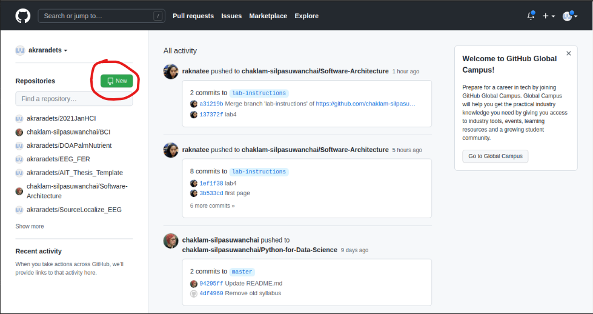
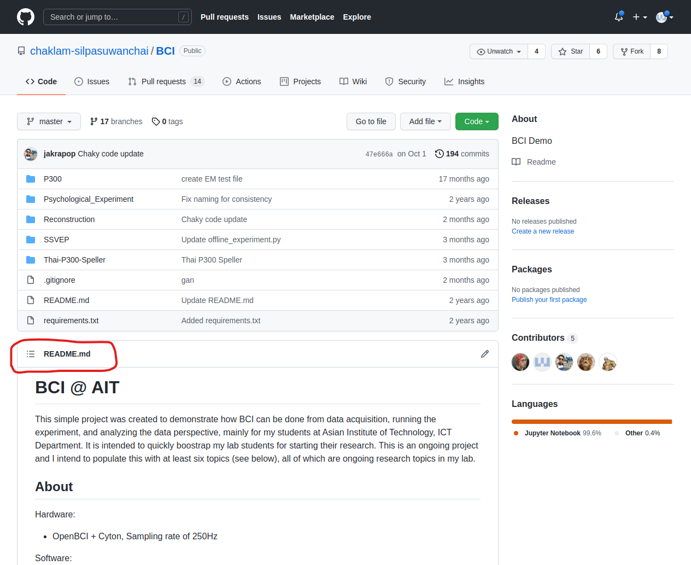

# Workshop 1. Setup your GitHub

For this task, we will setup your GitHub account and play around with your shinny reposistory.

[[toc]]

## Task 1-A. Sign-up to GitHub.com

Go to [GitHub](www.github.com) and register github using your personal information. You can create this account as your personal account. You can even use it as your life portfolio to show off your developing skill.

Once you create your account using your personal email, you can add your academic email to get the benefit of GitHub Education.

1. Navigate to [GitHub](www.github.com)
2. go to "setting"
3. On left hand side, go to "Emails"
4. Just add your st12xxxx.ait.asia

## Task 1-B. Create new reposistory

Before we create a reposistory, let's explore what and why we should do this.

### Question: What is git?

> [Wiki](https://en.wikipedia.org/wiki/Git)
>
> Git is software for tracking changes in any set of files, usually used for coordinating work among programmers collaboratively developing source code during software development. Its goals include speed, data integrity, and support for distributed, non-linear workflows (thousands of parallel branches running on different systems).
  
In my word, GIT is a protocol. It is just a name. Just like when I say Python, it is just a programming language. The point of GIT is to do **version control** and **team colloborating**.

### Question: What is version control?

> [Atlassian](https://www.atlassian.com/git/tutorials/what-is-version-control)
>
> Version control, also known as source control, is the practice of tracking and managing changes to software code. Version control systems are software tools that help software teams manage changes to source code over time.

Imagine your friend promise to return 100 baht back to you. You create a Google Docs to record this promise and sign. A few days pass, you come back to the document and the return amount is changed to 10 baht. What would you do?

If you have set some sort of **version control** on your Google Docs, you would be able to track any changes to your document including Who change the doc, When the doc is modified, Where/Which line of content is changed. All of this is done automatically and efficiently in Git.

The basic **version control** you may have done your whole life is to save your work as

- *project_new*
- *project_current*
- *project_final*
- *project_final_final*
- *project_okay_im_done*

### Question: What is GitHub?

> [Wiki](https://en.wikipedia.org/wiki/GitHub)
>
> GitHub, Inc. is a provider of Internet hosting for software development and version control using Git. It offers the distributed version control and source code management (SCM) functionality of Git, plus its own features. It provides access control and several collaboration features such as bug tracking, feature requests, task management, continuous integration and wikis for every project.

Github = Youtube

You = youtube channel

Reposistory = Video

### Question: What is reposistory?

> [Cambridge](https://dictionary.cambridge.org/dictionary/english/repository)
>
> Reposistory (noun) - a place where things are stored and can be found

It is a storage to hold/keep something. In GitHub, a bunch of document/file is expected to be stored in a reposistory.

--------------------------------------------------------------------------------------

Now that you feel the important of Git and GitHub, we will create one.

1. Navigate to [GitHub](www.github.com)
2. click the green button that says "new"

3. You will land on "Create a new reposistory" page.
4. Just fill in the information as you like.

::: tip README
[link](https://github.com/chaklam-silpasuwanchai/BCI) Check this Reposistory.

The nice informative section below of the reposistory is automatically display in GitHub when you have "README.md". The extension **.md** stands for markdown language. If you want your reposistory to look professional, you might want to learn the markdown language.
:::

::: tip .gitignore
We will learn what and why .gitignore later on. For now, you can just uncheck the box.
:::

::: tip LICENSE
Since we are sharing our code to the world (if you choose public option), you might want to set your condition when your code is free to use. You can crafting the license yourself or select the pre-defined one.
:::

We stop the GitHub thing for now and shift the gear to Developing environment.

     
        ←
        <a href="./lab01.html" class="prev">Lab1 - Main Page</a>
     
    
        <a href="./setup-linux.html" class="">Workshop 2 - Have accessible Linux environment</a>
        →
    

