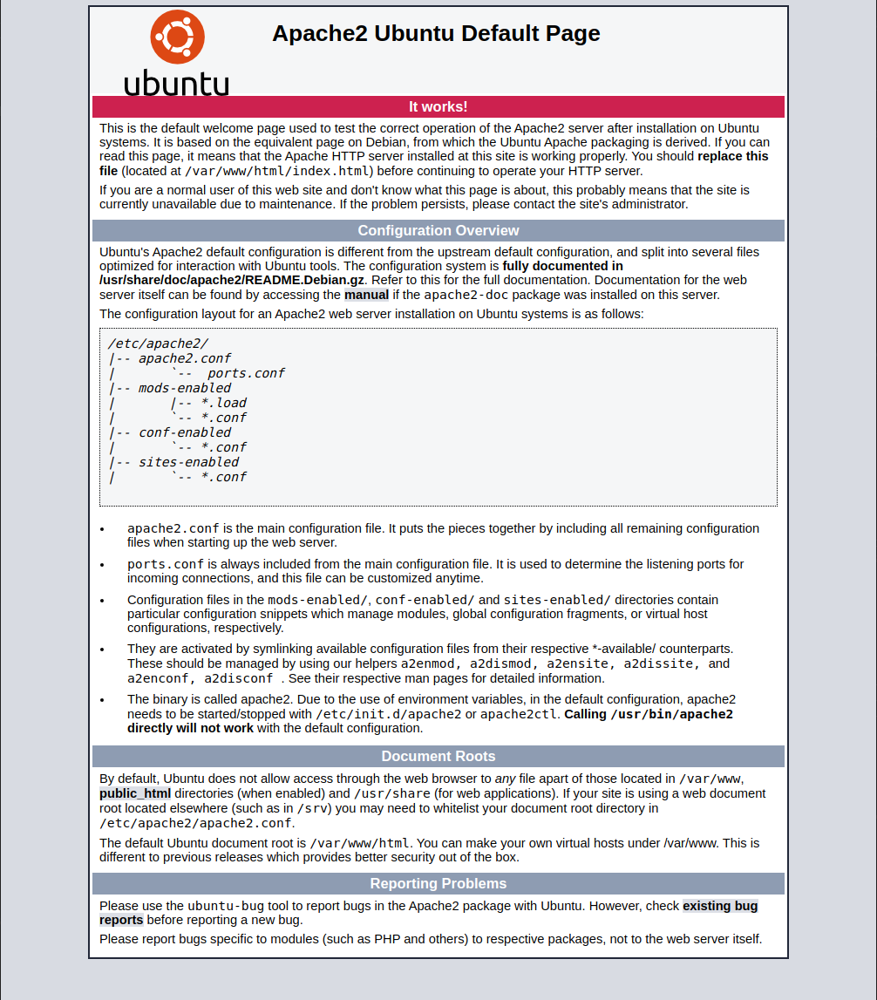

# Workshop 1. Core component of Web

[[toc]]

## Task 1-1. HyperText Markup Language (HTML)

Before we go any futhur, everything in computer is a text. A certian form/format/syntax of a text is a language. A well defined unambiguous language can be processed/interpreted by a machine.

> [techterms.com](https://techterms.com/definition/markup_language)
> 
> A markup language is a computer language that uses tags to define elements within a document. It is human-readable, meaning markup files contain standard words, rather than typical programming syntax. While several markup languages exist, the two most popular are **HTML** and **XML**.

The different between **XML** and **HTML** and other **--ML** is the meaning and predefined tags. A **HTML** cen be interpreted by a web browser.

Let's create a HTML file.

```sh
cd ~
mkdir playGrd
cd playGrd
touch myHTML
```

Open `myHTML` and copy the below HTML into the file.

```html
<div>
    <h1>HelloWorld</h1>
    <b>Task 1-1:</b>HyperText Markup Language (HTML)
</div>
```

Now, open your browser and put in the path `file:///home/{your_name}/playGrd/myHTML`.

**Example from Google Chrome**


**Example from Firefox**


Oops~! **Google Chrome** does not display the document in html form but **Firefox** does. Does it? To debug this, you need to do `inspect element`.

On both browser, right click and the select `Inspect` at the last option. Or `F12` as a shortcut in **Google Chrome**.

**Example from Google Chrome**


**Example from Firefox**


This `Inspect` tool is the first tool you will need to be familiar with if you choose to go on this web developing career. 

As you can see, both browser does display the document correctly (because there is no error) but they chose to interpret the document differently. Let's rename the `myHTML` to `myHTML.html`.

```sh
mv myHTML myHTML.html
```
Now, open your browser and put in the path `file:///home/{your_name}/playGrd/myHTML.html`.

**Example from Google Chrome (Left) and Firefox (right)**


Now, both browser does display our file the same way. Does it? Observe closely. The size of the text does not match. In fact, the font family of both browser does not match. This mismatch text display is only the tip of the iceberg. Under the hood, browsers are build differently. Even new version of **Google Chrome** may cause this page to render differently.

Now, let's only focus on **Google Chrome**.

As you see from the `Inspect` tool, browser put our data inside the tag `<body>` and complete the HTML document for us by adding `<head>` and `<html>` tag. 

Let's just complete our document using the HTML provided from the **Google Chrome** `Inspect` tool.

```html
<html>
    <head>
    </head>
    <body>
        <div>
            <h1>HelloWorld</h1>
            <b>Task 1-1:</b>HyperText Markup Language (HTML)
        </div>
    </body>
</html>
```

This section stop here because if we go furthur than this we will study how to write HTML instead of understanding what is HTML and its role.

## Task 1-2. Cascading Style Sheets (CSS)

Currently, **Google Chrome** renders `myHTML.html` as a plain text. If you want your website to look fancier and colourful then you will need Cascading Style Sheets (CSS).

Cascading Style Sheets (CSS) is another language with its own syntax. It is designed to tell interpretator (browser) how to render the document. Currently, each browser has its own default CSS (as shown in previous task).

Now, we want to be in-control-of what to be rendered. Perhaps, we want `<h1>` for displaying text bigger than what it already is. There are multiple ways you an achived this.

**Example of what I want**:


### 1-2.1 Inline CSS

```html {6}
<html>
    <head>
    </head>
    <body>
        <div>
            <h1 style="font-size: 100px;">HelloWorld</h1>
            <b>Task 1-1:</b>HyperText Markup Language (HTML)
        </div>
    </body>
</html>
```

### 1-2.2 Seperate CSS section

```html {5-9}
<html>
    <head>
    </head>
    <body>
        <style>
            h1 {
                font-size: 100px;
            }
        </style>
        <div>
            <h1>HelloWorld</h1>
            <b>Task 1-1:</b>HyperText Markup Language (HTML)
        </div>
    </body>
</html>
```

```html {3-7}
<html>
    <head>
        <style>
            h1 {
                font-size: 100px;
            }
        </style>
    </head>
    <body>
        <div>
            <h1>HelloWorld</h1>
            <b>Task 1-1:</b>HyperText Markup Language (HTML)
        </div>
    </body>
</html>
```

```html {9-13}
<html>
    <head>
    </head>
    <body>
        <div>
            <h1>HelloWorld</h1>
            <b>Task 1-1:</b>HyperText Markup Language (HTML)
        </div>
        <style>
            h1 {
                font-size: 100px;
            }
        </style>
    </body>
</html>
```

### 1-2.3 Seperate CSS file

This is the same as the previous one but instead of HTML and CSS in one single file, we can divided them into multiple files. 

myHTML.html

```html {3}
<html>
    <head>
        <link rel="stylesheet" href="./myStyle.css">
   </head>
    <body>
        <div>
            <h1>HelloWorld</h1>
            <b>Task 1-1:</b>HyperText Markup Language (HTML)
        </div>
    </body>
</html>
```

myStyle.css

```css
h1 {
    font-size: 100px;
}
```

------------

CSS can do much more. From formatting your document to create an animation. Mastering HTML and CSS is one of the area on its own.

## Task 1-3. Distributing our document with Web Server.

Everything we have done so far is only done in an Offline manner. **Google Chrome** opens our `myHTML.html` directly from the path `file:///home/{your_name}/playGrd/myHTML.html`. In order to distribute our web, we need a web server.

> [economictimes.indiatimes.com](https://economictimes.indiatimes.com/definition/web-server)
>
> Definition: A web server is a computer that runs websites. It's a computer program that distributes web pages as they are requisitioned. The basic objective of the web server is to store, process and deliver web pages to the users. This intercommunication is done using Hypertext Transfer Protocol (HTTP). These web pages are mostly static content that includes HTML documents, images, style sheets, test etc. Apart from HTTP, a web server also supports SMTP (Simple Mail transfer Protocol) and FTP (File Transfer Protocol) protocol for emailing and for file transfer and storage.

It takes sometime before I relized that a **server** is just a role of a computer. Any machine can be designated a server. In this topology there are two common roles, **Server** and **Client**. The one who serves is a server, obviously. The one who requests is a client, of cause.

**Example of Topology**:


Ref: informationq.com

There are multiple ways you can do to make your computer act as a **Web Server**. For today session, we will install **The Apache HTTP Server**, commonly called **Apache2**.

Go to your terminal and run the following command.

```sh
$ sudo apt install apache2
[sudo] password for {your_name}: 
Reading package lists... Done
Building dependency tree       
Reading state information... Done
The following additional packages will be installed:
  apache2-bin apache2-data apache2-utils libapr1 libaprutil1 libaprutil1-dbd-sqlite3 libaprutil1-ldap liblua5.2-0
Suggested packages:
  apache2-doc apache2-suexec-pristine | apache2-suexec-custom
The following NEW packages will be installed:
  apache2 apache2-bin apache2-data apache2-utils libapr1 libaprutil1 libaprutil1-dbd-sqlite3 libaprutil1-ldap liblua5.2-0
0 upgraded, 9 newly installed, 0 to remove and 0 not upgraded.
Need to get 1,820 kB of archives.
After this operation, 7,945 kB of additional disk space will be used.
Do you want to continue? [Y/n] 
Get:1 http://mirror1.ku.ac.th/ubuntu focal/main amd64 libapr1 amd64 1.6.5-1ubuntu1 [91.4 kB]
.
.
.
```

To check your installation, run the following command.

Here we check the status of `apache2` service. It should say `Active: active (running)`

```sh {4}
$ sudo service apache2 status
● apache2.service - The Apache HTTP Server
     Loaded: loaded (/lib/systemd/system/apache2.service; enabled; vendor preset: enabled)
     Active: active (running) since Sat 2021-12-25 21:57:46 +07; 3min 22s ago
       Docs: https://httpd.apache.org/docs/2.4/
   Main PID: 11225 (apache2)
      Tasks: 55 (limit: 9430)
     Memory: 5.0M
     CGroup: /system.slice/apache2.service
             ├─11225 /usr/sbin/apache2 -k start
             ├─11226 /usr/sbin/apache2 -k start
             └─11227 /usr/sbin/apache2 -k start

Dec 25 21:57:46 ubuntu systemd[1]: Starting The Apache HTTP Server...
Dec 25 21:57:46 ubuntu apachectl[11224]: AH00558: apache2: Could not reliably determine the server's fully qualified domain name, using 127.0.1.1. Set the 'ServerName' directive globally to suppress this message
Dec 25 21:57:46 ubuntu systemd[1]: Started The Apache HTTP Server.
```

Here we check that the port `80` is in used and should be in used by `apache2` service. 

```sh
$ sudo lsof -i :80
COMMAND   PID     USER   FD   TYPE DEVICE SIZE/OFF NODE NAME
apache2 11225     root    4u  IPv6 114459      0t0  TCP *:http (LISTEN)
apache2 11226 www-data    4u  IPv6 114459      0t0  TCP *:http (LISTEN)
apache2 11227 www-data    4u  IPv6 114459      0t0  TCP *:http (LISTEN)
```

Here is another command for checking the port.

```sh
$ sudo ss -tunlp | grep 80
tcp  LISTEN  0  511  *:80  *:*  users:(("apache2",pid=11227,fd=4),("apache2",pid=11226,fd=4),("apache2",pid=11225,fd=4))
```

Go to your browser and put in `localhost` in the address bar. You should see something similar.



We could spend time reading this page now and I would recommend you to read it if you want to go deep into the configuration route. The question for us right now is **Where is this page located?** and **What happen after entering `localhost` until you see the page?**. 

A full version of what happend after entering `localhost` would consist of tons of detail about networking namely DNS, TCP, HTTP etc. It is an essential knowledge but it would not be SAD is we start talking about this topic. A simplify version is as followed.

1. Once you hit the enter, the client (in this case is your browser) sends a request to an address `localhost`.
2. A magic of networking happens and the server (in this case is your `apache2` service installed in the computer) receives a request message.
3. The server looks up the request, **resolves**, and responses back the HTML document.
4. A magic of networking happens and the client receives the HTML document. If the client is a browser, it renders the HTML document.

**Resolve?**

There are tons of feature in the `apache2`. Therefore, I will only focus on this default/basic case. In `apache2`, there is a `Document Root`. A `Document Root` is the location of your project. By default, the `Document Root` is `/var/www/html`. Let's go see our `document root`.

```sh
$ cd /var/www/html
$ ls -l
total 12
-rw-r--r-- 1 root root 10918 Dec 25 21:57 index.html
$ head index.html

<!DOCTYPE html PUBLIC "-//W3C//DTD XHTML 1.0 Transitional//EN" "http://www.w3.org/TR/xhtml1/DTD/xhtml1-transitional.dtd">
<html xmlns="http://www.w3.org/1999/xhtml">
  <!--
    Modified from the Debian original for Ubuntu
    Last updated: 2016-11-16
    See: https://launchpad.net/bugs/1288690
  -->
  <head>
    <meta http-equiv="Content-Type" content="text/html; charset=UTF-8" />
```

In the `/var/www/html`, there is only one file named `index.html`. From observing the file, it is, in fact, the information page we saw earlier. Now, go back to your browser and type `localhost/index.html`. You will see the same page as before. This behavior comes from the fact that `apache2` will look for a **index.html** file in the `Document Root` and serve the file. Let's migrate our `playGrd` project to this document root.

```sh
$ sudo mv ~/playGrd/myHTML.html ~/playGrd/myStyle.css .
$ ls -l
total 20
-rw-r--r-- 1 root     root     10918 Dec 25 21:57 index.html
-rw-rw-r-- 1 {your_name} {your_name}   228 Dec 22 15:15 myHTML.html
-rw-rw-r-- 1 {your_name} {your_name}    29 Dec 22 15:12 myStyle.css
```

Now, in your browser, enter `localhost/myHTML.html`


Voila!!! You are now serving your document over the internet (sort of). We could play around with the URLs by put our project inside a folder.

```sh
$ sudo mkdir myHTML
$ mv myHTML.html myStyle.css my
myHTML/      myHTML.html  myStyle.css  
$ sudo mv myHTML.html myHTML/index.html
$ sudo mv myStyle.css  myHTML/
$ ll
total 24
drwxr-xr-x 3 root root  4096 Dec 25 23:50 ./
drwxr-xr-x 3 root root  4096 Dec 25 21:57 ../
-rw-r--r-- 1 root root 10918 Dec 25 21:57 index.html
drwxr-xr-x 2 root root  4096 Dec 25 23:50 myHTML/
$ ls -l myHTML/
total 8
-rw-rw-r-- 1 {your_name} {your_name} 228 Dec 22 15:15 index.html
-rw-rw-r-- 1 {your_name} {your_name}  29 Dec 22 15:12 myStyle.css
```

Now, in your browser, type in the address bar `localhost/myHTML`.

----

We have achived our first static website. Although the site is accessible by you only, it is a full feature static website.

<div class="page-nav"><p class="inner">
    <span class="prev"> 
        <a href="./lab02.html" class="">Lab2 - Main Page</a>
    </span> 
    <span class="next">
        <a href="./dynamic-website.html" class="">Workshop 2 - Dynamic Website</a>
        →
    </span></p>
</div>