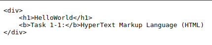
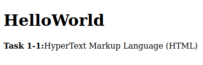
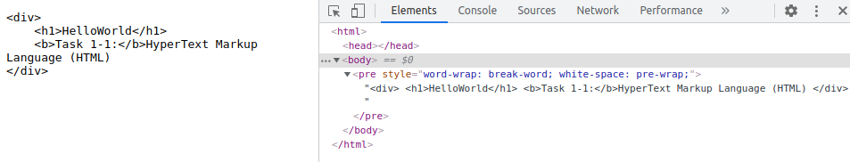
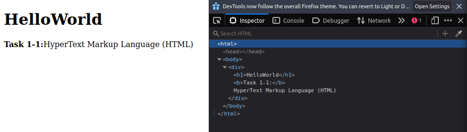
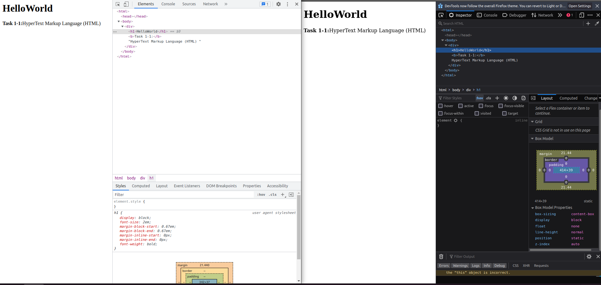

# Workshop 1. Core component of Web

[[toc]]

## Task 1-1. HyperText Markup Language (HTML)

Before we go any futhur, everything in computer is a text. A certian form/format/syntax of a text is a language. A well defined unambiguous language can be processed/interpreted by a machine.

> [techterms.com](https://techterms.com/definition/markup_language)
> 
> A markup language is a computer language that uses tags to define elements within a document. It is human-readable, meaning markup files contain standard words, rather than typical programming syntax. While several markup languages exist, the two most popular are **HTML** and **XML**.

The different between **XML** and **HTML** and other **--ML** is the meaning and predefined tags. A **HTML** cen be interpreted by a web browser.

Let's create a HTML file.

```sh
cd ~
mkdir playGrd
cd playGrd
touch myHTML
```

Open `myHTML` and copy the below HTML into the file.

```html
<div>
    <h1>HelloWorld</h1>
    <b>Task 1-1:</b>HyperText Markup Language (HTML)
</div>
```

Now, open your browser and put in the path `file:///home/{your_name}/playGrd/myHTML`.

**Example from Google Chrome**



**Example from Firefox**



Oops~! **Google Chrome** does not display the document in html form but **Firefox** does. Does it? To debug this, you need to do `inspect element`.

On both browser, right click and the select `Inspect` at the last option. Or `F12` as a shortcut in **Google Chrome**.

**Example from Google Chrome**



**Example from Firefox**



This `Inspect` tool is the first tool you will need to be familiar with if you choose to go on this web developing career. 

As you can see, both browser does display the document correctly (because there is no error) but they chose to interpret the document differently. Let's rename the `myHTML` to `myHTML.html`.

```sh
mv myHTML myHTML.html
```
Now, open your browser and put in the path `file:///home/{your_name}/playGrd/myHTML.html`.

**Example from Google Chrome (Left) and Firefox (right)**



Now, both browser does display our file the same way. Does it? Observe closely. The size of the text does not match. In fact, the font family of both browser does not match. This mismatch text display is only the tip of the iceberg. Under the hood, browsers are build differently. Even new version of **Google Chrome** may cause this page to render differently.

Now, let's only focus on **Google Chrome**.

As you see from the `Inspect` tool, browser put our data inside the tag `<body>` and complete the HTML document for us by adding `<head>` and `<html>` tag. 