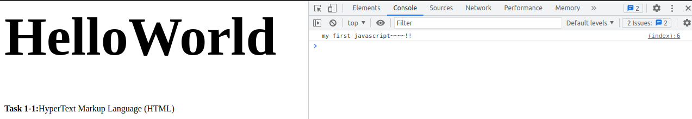

# Workshop 2. Dynamic Website

[[toc]]

## What is Dynamic Website?

>[spiralytics](https://www.spiralytics.com/blog/what-are-dynamic-websites/)
> 
> A dynamic website is a website that displays different types of content every time a user views it. This display changes depending on a number of factors like viewer demographics, time of day, location, language settings, and so on.
>
> While static pages require manual updating before their contents change, dynamic websites offer unique content to visitors each time they view the site. This is done through a combination of client-side and server-side scripting.
>
> - **Client-side scripting** involves code that is executed by the viewer’s browser, using scripting languages like JavaScript. This scripting is responsible for rendering changes to the webpage as a response to actions taken within it, such as mouse clicks or keyboard use.
> - **Server-side scripting**, on the other hand, refers to code that is executed by the server before sending the content to the viewer’s browser. This affects the webpage when it is loaded or visited, like with login pages, submission forms, and shopping carts.
> 
> Using both types of scripting allows modern websites to adapt to each user’s view of the page while reducing the server’s load time.

A dynamic website has some level of programming involved. There are two kinds of this programming discriminate by where is the code runs, a **client-side code** and a **server-side code**. We will play around with this two kinds of code.

## Task 2-1. Client-Side Code

As the name suggests, this is the code that exceute on the client (your browser). In the document, there is a section of this code. The browser will runs the code. The common and widely use language for this is `JavaScript`.

Let's write `JavaScript` into our site. Augment our `myHTML/index.html` as follow.

```html {5-7}
<html>
    <head>
   </head>
    <body>
        <script>
            console.log("my first javascript~~~~!!");
        </script>
        <div>
            <h1>HelloWorld</h1>
            <b>Task 1-1:</b>HyperText Markup Language (HTML)
        </div>
        <link rel="stylesheet" href="./myStyle.css">
    </body>
</html>
```

In your browser, open the `console` by *right click > inspect* and select *console* tab. Enter `localhost/myHTML` in the address bar and enter.



### Script Order

What runs first? We can run figure this out by augmenting our code.

```html {5-9,14-16,18-20}
<html>
    <head>
   </head>
    <body>
        <script>
            alert('a');
            console.log("my first javascript~~~~!!");
            alert('b');
        </script>
        <div>
            <h1>HelloWorld</h1>
            <b>Task 1-1:</b>HyperText Markup Language (HTML)
        </div>
        <script>
            alert('c');
        </script>
        <div>
            <h1>HelloWorld 2</h1>
            <b>Task 1-1:</b>HyperText Markup Language (HTML)
        </div>
        <script>
            alert('d');
        </script>
        <link rel="stylesheet" href="./myStyle.css">
        <script>
            alert('e');
        </script>
    </body>
</html>
```

Observe each alert closely and you will see that the the document is indeed runs as a script (from top to bottom).


## Task 2-2. Server-Side Code

asd

<div class="page-nav"><p class="inner">
    <span class="prev"> 
        ←
        <a href="./core-component-of-web.html" class="">Workshop 1 - Core component of Web</a>
    </span> 
    <span class="next">
        <!-- <a href="./setup-linux.html" class="">Workshop 2 - Have accessible Linux environment</a>
        → -->
    </span></p>
</div>