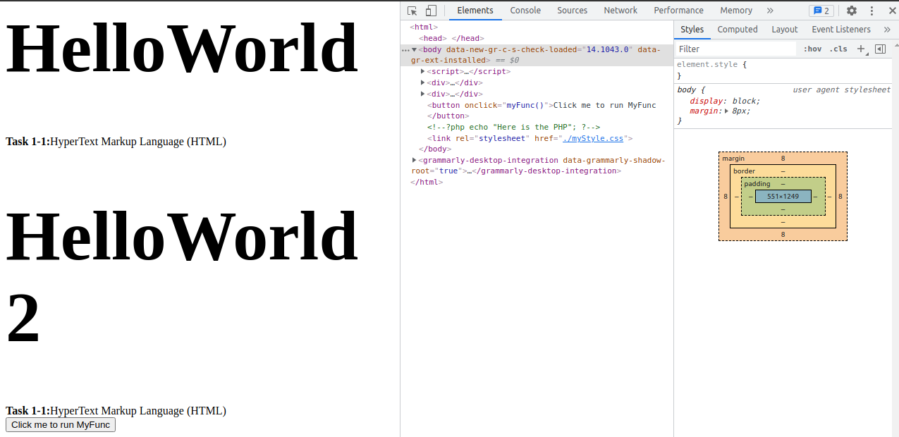

# Workshop 2. Dynamic Website

[[toc]]

## What is Dynamic Website?

>[spiralytics](https://www.spiralytics.com/blog/what-are-dynamic-websites/)
> 
> A dynamic website is a website that displays different types of content every time a user views it. This display changes depending on a number of factors like viewer demographics, time of day, location, language settings, and so on.
>
> While static pages require manual updating before their contents change, dynamic websites offer unique content to visitors each time they view the site. This is done through a combination of client-side and server-side scripting.
>
> - **Client-side scripting** involves code that is executed by the viewer’s browser, using scripting languages like JavaScript. This scripting is responsible for rendering changes to the webpage as a response to actions taken within it, such as mouse clicks or keyboard use.
> - **Server-side scripting**, on the other hand, refers to code that is executed by the server before sending the content to the viewer’s browser. This affects the webpage when it is loaded or visited, like with login pages, submission forms, and shopping carts.
> 
> Using both types of scripting allows modern websites to adapt to each user’s view of the page while reducing the server’s load time.

A dynamic website has some level of programming involved. There are two kinds of this programming discriminate by where is the code runs, a **client-side code** and a **server-side code**. We will play around with this two kinds of code.

## Task 2-1. Client-Side Code

As the name suggests, this is the code that exceute on the client (your browser). In the document, there is a section of this code. The browser will runs the code. The common and widely use language for this is `JavaScript`.

Let's write `JavaScript` into our site. Augment our `myHTML/index.html` as follow.

```html {5-7}
<html>
    <head>
   </head>
    <body>
        <script>
            console.log("my first javascript~~~~!!");
        </script>
        <div>
            <h1>HelloWorld</h1>
            <b>Task 1-1:</b>HyperText Markup Language (HTML)
        </div>
        <link rel="stylesheet" href="./myStyle.css">
    </body>
</html>
```

In your browser, open the `console` by *right click > inspect* and select *console* tab. Enter `localhost/myHTML` in the address bar and enter.


### Script Order

What runs first? We can run figure this out by augmenting our code.

```html {5-9,14-16,18-20}
<html>
    <head>
   </head>
    <body>
        <script>
            alert('a');
            console.log("my first javascript~~~~!!");
            alert('b');
        </script>
        <div>
            <h1>HelloWorld</h1>
            <b>Task 1-1:</b>HyperText Markup Language (HTML)
        </div>
        <script>
            alert('c');
        </script>
        <div>
            <h1>HelloWorld 2</h1>
            <b>Task 1-1:</b>HyperText Markup Language (HTML)
        </div>
        <script>
            alert('d');
        </script>
        <link rel="stylesheet" href="./myStyle.css">
        <script>
            alert('e');
        </script>
    </body>
</html>
```

Observe each alert closely and you will see that the the document is indeed runs as a script (from top to bottom).

One critical thing you need to remember is that the **Client-Side Code** is given to the browser. Therefore, the user has full control of the code.

```html {4-9,18}
<html>
    <head>
   </head>
    <body>
        <script>
            function myFunc(){
                console.log('Original myFunc');
            }
        </script>
        <div>
            <h1>HelloWorld</h1>
            <b>Task 1-1:</b>HyperText Markup Language (HTML)
        </div>
        <div>
            <h1>HelloWorld 2</h1>
            <b>Task 1-1:</b>HyperText Markup Language (HTML)
        </div>
        <button onClick="myFunc()">Click me to run MyFunc</button>
        <link rel="stylesheet" href="./myStyle.css">
    </body>
</html>
```

Open the browser and observe the console. When you click the button, the console prints out "Ofiginal myFunc". Now, copy the following code to the console and click the button again.

```javascript
function myFunc(){
    console.log('Augmented myFunc');
}
```

Suddenly, your `myFunc` is now changed. This is why we call **client-side code**. The code is given to the client as an instruction. The client may or may not follow the instruction. 

## Task 2-2. Server-Side Code

Another type of code is the **Server-Side Code**. Thus, the code runs on the host/server. Here we have to decide which language we want to write and tell `apache2` that there is a programming language embedded. For the sake of simplicity, we will do it in `PHP`.

```php {19}
<html>
    <head>
   </head>
    <body>
        <script>
            function myFunc(){
                console.log('Original myFunc');
            }
        </script>
        <div>
            <h1>HelloWorld</h1>
            <b>Task 1-1:</b>HyperText Markup Language (HTML)
        </div>
        <div>
            <h1>HelloWorld 2</h1>
            <b>Task 1-1:</b>HyperText Markup Language (HTML)
        </div>
        <button onClick="myFunc()">Click me to run MyFunc</button>
        <?php echo "Here is the PHP"; ?>
        <link rel="stylesheet" href="./myStyle.css">
    </body>
</html>
```



Look closely in the `Elements` tab. The section of the `php` code is commented out. Let's fix that. Go to the terminal and install the following package.

```sh
$ sudo apt install php libapache2-mod-php
Reading package lists... Done
Building dependency tree       
Reading state information... Done
The following additional packages will be installed:
  libapache2-mod-php7.4 php-common php7.4 php7.4-cli php7.4-common php7.4-json php7.4-opcache php7.4-readline
Suggested packages:
  php-pear
The following NEW packages will be installed:
  libapache2-mod-php libapache2-mod-php7.4 php php-common php7.4 php7.4-cli php7.4-common php7.4-json php7.4-opcache php7.4-readline
0 upgraded, 10 newly installed, 0 to remove and 0 not upgraded.
.
.
.
```

Rename our `index.html` to `index.php` and refresh the browser.


Let's play around with `GET` argument.

```php {20}
<html>
    <head>
   </head>
    <body>
        <script>
            function myFunc(){
                console.log('Original myFunc');
            }
        </script>
        <div>
            <h1>HelloWorld</h1>
            <b>Task 1-1:</b>HyperText Markup Language (HTML)
        </div>
        <div>
            <h1>HelloWorld 2</h1>
            <b>Task 1-1:</b>HyperText Markup Language (HTML)
        </div>
        <button onClick="myFunc()">Click me to run MyFunc</button>
        <?php echo "Here is the PHP"; ?>
        <?php echo "$_GET[var]"; ?>
        <link rel="stylesheet" href="./myStyle.css">
    </body>
</html>
```

In the browser, change the url to `http://localhost/myHTML/?var=SAD~~~!`


What happen is the host will execute all the `php` code. What ever happens, it packs the result as the HTML document and sends the document to the client. In this case, the client will never see the `php` code. 

<div class="page-nav"><p class="inner">
    <span class="prev"> 
        ←
        <a href="./core-component-of-web.html" class="">Workshop 1 - Core component of Web</a>
    </span> 
    <span class="next">
        <a href="./homework-2.html" class="">Homework</a>
        →
    </span></p>
</div>