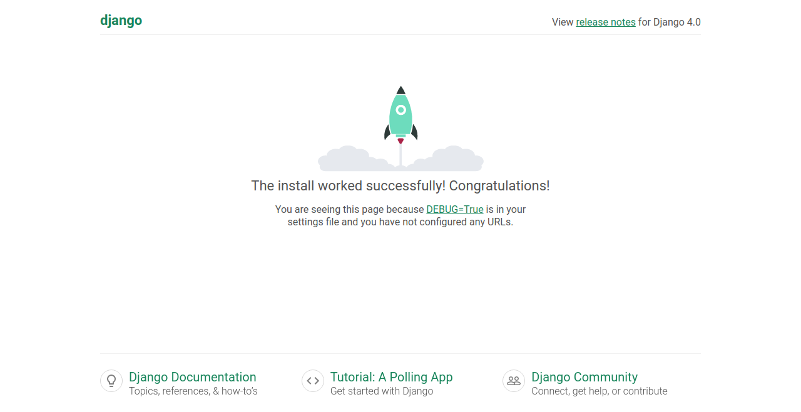
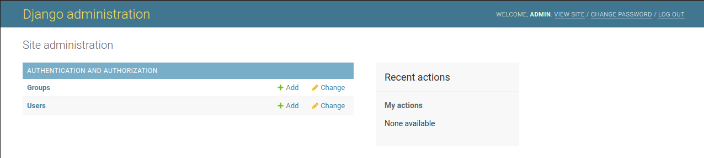
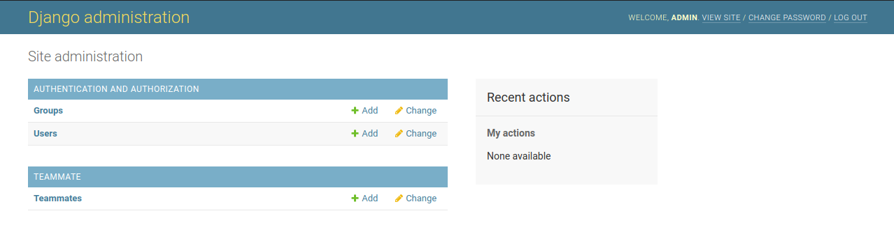
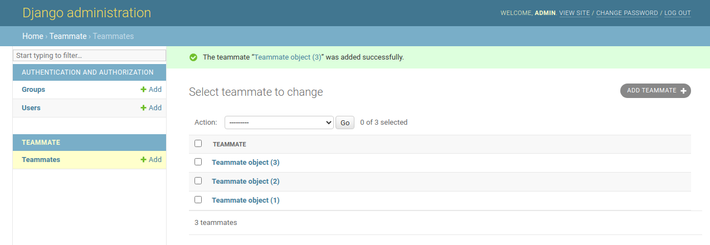
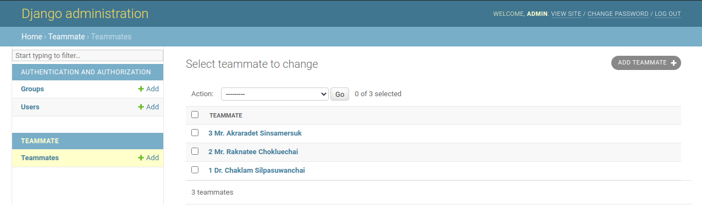
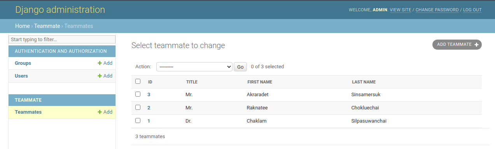

# Workshop 2. Django Philosophy

[[toc]]

## What is Django?

We have not yet talk about Django. Django is a web development framework written in Python. There are tons of framework out there written in many many languages. A real question to ask is what is a framework and why should we care?

> [wiki](https://en.wikipedia.org/wiki/Software_framework)
>
> In computer programming, a **software framework** is an abstraction in which software, providing generic functionality, can be selectively changed by additional user-written code, thus providing application-specific software. It provides a standard way to build and deploy applications and is a universal, reusable software environment that provides particular functionality as part of a larger software platform to facilitate the development of software applications, products and solutions. Software frameworks may include support programs, compilers, code libraries, toolsets, and application programming interfaces (APIs) that bring together all the different components to enable development of a project or system.
>
> Frameworks have key distinguishing features that separate them from normal libraries:
> 
> - inversion of control: In a framework, unlike in libraries or in standard user applications, the overall program's flow of control is not dictated by the caller, but by the framework. This is usually achieved with the Template Method Pattern.
> - default behaviour: This can be provided with the invariant methods of the Template Method Pattern in an abstract class which is provided by the framework.
> - extensibility: A user can extend the framework – usually by selective overriding – or programmers can add specialized user code to provide specific functionality. This is usually achieved by a hook method in a subclass that overrides a template method in the superclass.
> - non-modifiable framework code: The framework code, in general, is not supposed to be modified, while accepting user-implemented extensions. In other words, users can extend the framework, but cannot modify its code.

In my word, a framework control how you code. It embeds a way of thinking, designing, and developing. Remember in the previous labs, without a framework, you are free to do anything. Imagine that you are a new employee of a company. They give you a project to maintain. If the project written in a frameworkless way, how long do you need to understand all the code? On the other hand, if the project written in python and with Django, you will be familiar with the core structure and functions right away.

With a framework, your team will work in a similar fashion (in some level). When your team understands the same framework, you would not need to establish a developing protocol. This means all of the team member follow the best practice/guidelines of that framework. If you decide not to use a framework, finally, at some point, you will establish your own philosophy or your project is a mess.

In web development, a CRUD (create-remove-update-delete) is a very common operations. Data is store in the database and your program has to fetch and manipulate it. Instead of writing, testing, and debuging everything from the ground up, a CRUD framework would have done that for you and all you need is to focus on modelling and designing your web. In addition, a web all has a common security risk. [Top 10 Web Application Security Risks by OWASP](https://owasp.org/www-project-top-ten/) is a list of risk. A framework will not fix all the risks but it would certainly prevent an easy vulnerability like **SQL injection**. 

## Django Web Components


ref: developer.mozilla.org

You might be familiar with MVC architecture (Model-View-Controller). In Django, the architecture is MVT (Model-View-Template). We could argure on and on which one is better ([MVC vs MVT](https://www.geekinsta.com/difference-between-mvc-and-mvt/)). At the end of the day, you choose which one you preferred and suited to the problem you are solving.

## Task 2-1. Initiate the project

```sh
(.venv) $ cd ~/playGrd/myDjango-app
(.venv) $ django-admin startproject mysite
```

Here is what you should have.

```text
myDjango-app/
    .venv/
    mysite/
        manage.py
        mysite/
            __init__.py
            settings.py
            urls.py
            asgi.py
            wsgi.py
```

We could take a look at our first site by running a server

```sh
(.venv) $ cd ~/playGrd/myDjango-app/mysite
(.venv) $ python3 manage.py runserver
Watching for file changes with StatReloader
Performing system checks...

System check identified no issues (0 silenced).

You have 18 unapplied migration(s). Your project may not work properly until you apply the migrations for app(s): admin, auth, contenttypes, sessions.
Run 'python manage.py migrate' to apply them.
December 27, 2021 - 16:48:59
Django version 4.0, using settings 'mysite.settings'
Starting development server at http://127.0.0.1:8000/
Quit the server with CONTROL-C.
```

Go to your browser and put in the `http://127.0.0.1:8000/` in the address bar. You should see the congratulation page.



## Task 2-2. Config PostgreSQL

By default, `Django` use SQLite3 as a database. Once we run the project, it initiates a SQLite databse.

```text {4}
myDjango-app/
    .venv/
    mysite/
        db.dqlite3
        manage.py
        mysite/
            __init__.py
            settings.py
            urls.py
            asgi.py
            wsgi.py
```

We will configure Django to use PostgreSQL.

First, create a database for our project.

```sh
(.venv) $ sudo -u postgres createdb mysite
```

In our `mysite` project, edit `settings.py` line 76.

```python
DATABASES = {
    'default': {
        'ENGINE': 'django.db.backends.postgresql',
        'NAME': 'mysite',
        'USER': 'postgres',
        'PASSWORD': '{your_postgres_password}',
        'HOST': '127.0.0.1',
        'PORT': '5432',
    }
}
```

Once you save, the server should restart with this message.

```sh
/home/{your_name}/playGrd/myDjango-app/mysite/mysite/settings.py changed, reloading.
Watching for file changes with StatReloader
Performing system checks...

System check identified no issues (0 silenced).

You have 18 unapplied migration(s). Your project may not work properly until you apply the migrations for app(s): admin, auth, contenttypes, sessions.
Run 'python manage.py migrate' to apply them.
December 27, 2021 - 17:45:09
Django version 4.0, using settings 'mysite.settings'
Starting development server at http://127.0.0.1:8000/
Quit the server with CONTROL-C.
```

The red text you see tells us that there are 18 unapplied migration(s). Remember this number for now.

## Task 2-3. Our first app

For this task, let's create a page that will show your members (again).


```sh
(.venv) $ cd ~/playGrd/myDjango-app/mysite
(.venv) $ python3 manage.py startapp teammate
```

Django creates a new folder with following files.

```text
teammate/
    __init__.py
    admin.py
    apps.py
    migrations/
        __init__.py
    models.py
    tests.py
    views.py
```

Edit the `teammate/views.py`

```python
from django.shortcuts import render
from django.http import HttpResponse

def index(request):
    return HttpResponse("Hey Hey Hey World!!!")
```

Edit the `mysite/urls.py`

```python
from django.contrib import admin
from django.urls import path
import teammate.views

urlpatterns = [
    path('admin/', admin.site.urls),
    path('', teammate.views.index, name='index')
]
```

Now, reload `127.0.0.1:8080`. You should see **Hey Hey Hey World!!!** message.

### 1. Do it in Static Way

We are going to manually write your team member name and print it out.

Edit the `teammate/views.py`

```python
from django.shortcuts import render
from django.http import HttpResponse

def index(request):
    members = ["Chaklam Silpasuwanchai", "Raknatee Chokluechai", "Akraradet Sinsamersuk"]
    return HttpResponse(", ".join(members))
```

### 2. Do it in Dynamic Way

We are going to model our teammate. That means we need to edit `tammate/models.py`

```python
from django.db import models

class Teammate(models.Model):
    first_name = models.CharField(max_length=200)
    last_name = models.CharField(max_length=200)
```

Create a migration file.

```sh
(.venv) $ python3 manage.py makemigrations teammate
Migrations for 'teammate':
  teammate/migrations/0001_initial.py
    - Create model Teammate
```

At this point, in order for the Django to notice the `teammate` app, we have to tell it in the `mysite/settings.py` at line 33

```python {2}
INSTALLED_APPS = [
    'teammate.apps.TeammateConfig',
    'django.contrib.admin',
    'django.contrib.auth',
    'django.contrib.contenttypes',
    'django.contrib.sessions',
    'django.contrib.messages',
    'django.contrib.staticfiles',
]
```

Now, rerun our app.

```sh
(.venv) $ python3 manage.py runserver
Watching for file changes with StatReloader
Performing system checks...

System check identified no issues (0 silenced).

You have 19 unapplied migration(s). Your project may not work properly until you apply the migrations for app(s): admin, auth, contenttypes, sessions, teammate.
Run 'python manage.py migrate' to apply them.
December 27, 2021 - 18:13:00
Django version 4.0, using settings 'mysite.settings'
Starting development server at http://127.0.0.1:8000/
Quit the server with CONTROL-C.
```

Now, the red text inform there is one addition unapplied migration. The migration is Django mechanism to keep track of the changes of models.

Let's augment our model a bit more to see what happen.

Edit `teammate/models.py`

```python {4}
from django.db import models

class Teammate(models.Model):
    title = models.CharField(max_length=10)
    first_name = models.CharField(max_length=200)
    last_name = models.CharField(max_length=200)
```

Run the *create migration* again

```sh
(.venv) $ python3 manage.py makemigrations teammate
It is impossible to add a non-nullable field 'title' to teammate without specifying a default. This is because the database needs something to populate existing rows.
Please select a fix:
 1) Provide a one-off default now (will be set on all existing rows with a null value for this column)
 2) Quit and manually define a default value in models.py.
Select an option:
```

Here Django force us to provide a default value. This happen because we did not tell Django that this field can be null. For now, we will choose option `1` and put `"Mr."` as a default value.

```sh
(.venv) $ python3 manage.py makemigrations teammate
It is impossible to add a non-nullable field 'title' to teammate without specifying a default. This is because the database needs something to populate existing rows.
Please select a fix:
 1) Provide a one-off default now (will be set on all existing rows with a null value for this column)
 2) Quit and manually define a default value in models.py.
Select an option: 1
Please enter the default value as valid Python.
The datetime and django.utils.timezone modules are available, so it is possible to provide e.g. timezone.now as a value.
Type 'exit' to exit this prompt
>>> "Mr."
Migrations for 'teammate':
  teammate/migrations/0002_teammate_title.py
    - Add field title to teammate
```

Actually, this is not a good option to choose. To understand why, we `migrate` and go to `Django Shell`.

```sh
(.venv) $ python3 manage.py migrate
Operations to perform:
  Apply all migrations: admin, auth, contenttypes, sessions, teammate
Running migrations:
  Applying contenttypes.0001_initial... OK
  Applying auth.0001_initial... OK
  Applying admin.0001_initial... OK
  Applying admin.0002_logentry_remove_auto_add... OK
  Applying admin.0003_logentry_add_action_flag_choices... OK
  Applying contenttypes.0002_remove_content_type_name... OK
  Applying auth.0002_alter_permission_name_max_length... OK
  Applying auth.0003_alter_user_email_max_length... OK
  Applying auth.0004_alter_user_username_opts... OK
  Applying auth.0005_alter_user_last_login_null... OK
  Applying auth.0006_require_contenttypes_0002... OK
  Applying auth.0007_alter_validators_add_error_messages... OK
  Applying auth.0008_alter_user_username_max_length... OK
  Applying auth.0009_alter_user_last_name_max_length... OK
  Applying auth.0010_alter_group_name_max_length... OK
  Applying auth.0011_update_proxy_permissions... OK
  Applying auth.0012_alter_user_first_name_max_length... OK
  Applying sessions.0001_initial... OK
  Applying teammate.0001_initial... OK
  Applying teammate.0002_teammate_title... OK
(.venv) $ python3 manage.py shell
Python 3.8.10 (default, Nov 26 2021, 20:14:08) 
[GCC 9.3.0] on linux
Type "help", "copyright", "credits" or "license" for more information.
(InteractiveConsole)
>>> from teammate.models import Teammate
>>> t = Teammate()
>>> t.title
''
```

As you can see, the Teammate does not actually have a title set to `"Mr."` becase we did not specify in the class. To fix that, we edit the `tammate/models.py`

```python {4}
from django.db import models

class Teammate(models.Model):
    title = models.CharField(max_length=10, default="Mr.")
    first_name = models.CharField(max_length=200)
    last_name = models.CharField(max_length=200)
```

```sh
(.venv) $ python3 manage.py makemigrations teammate
Migrations for 'teammate':
  teammate/migrations/0003_alter_teammate_title.py
    - Alter field title on teammate
(.venv) $ python3 manage.py migrate
Operations to perform:
  Apply all migrations: admin, auth, contenttypes, sessions, teammate
Running migrations:
  Applying teammate.0003_alter_teammate_title... OK
(.venv) $ python3 manage.py shell
Python 3.8.10 (default, Nov 26 2021, 20:14:08) 
[GCC 9.3.0] on linux
Type "help", "copyright", "credits" or "license" for more information.
(InteractiveConsole)
>>> from teammate.models import Teammate
>>> t = Teammate()
>>> t.title
'Mr.'
```

Another benefit of doing this way is the `model.py` itself is a document. You will know right away from reading this file that the title will have a default value as `"Mr."` (right at creation of object).

As we play in the `Django Shell`, it is possible to interact with the database and test the model functionality in that shell environment. We could also populate data too. However, I would like to show you the elegant way.

Before we can do that, we have to complete the `admin site` by creating a superuser account

```sh
(.venv) $ python3 manage.py createsuperuser
Username: admin
Email address: admin@example.com
Password: **********
Password (again): *********
Superuser created successfully.
```

You can put any Username, Email, and Password you like.

Run the server, and go to `localhost:8080/admin`. Login with the account you just created and you will land on the `Admin Dashboard`



In this page, you can perform any CRUD. But, hold on, there is no `Teammate`. That is because we have to register the model to adminsite.

Edit `tammate/admin.py`

```python
from django.contrib import admin
from .models import Teammate

admin.site.register(Teammate)
```

Run the server, and go to `localhost:8080/admin` again.



Use this feature to populate you tammate information.



The text written on the `TEAMMATE` table is not very information. We can change that.

#### Level 1. Override the `__str__`

Edit `teammate/models.py`

```python
from django.db import models

class Teammate(models.Model):
    title = models.CharField(max_length=10, default="Mr.")
    first_name = models.CharField(max_length=200)
    last_name = models.CharField(max_length=200)

    def __str__(self):
        return f"{self.id} {self.title} {self.first_name} {self.last_name}"
```



#### Level 2. Tell AdminSite what to display

Edit `teammate/models.py`

```python
from django.contrib import admin
from .models import Teammate

class TeammateAdmin(admin.ModelAdmin):
    list_display = ('id', 'title', 'first_name', 'last_name')

admin.site.register(Teammate, TeammateAdmin)
```



The difference betweem the two levels is the the first one display everything in one column while the second one display in four columns. The benefit is you can sort each columns.

------

Okay, back on track of writing a dynamic way. 

Edit `teammate/views.py`

```python
from django.shortcuts import render
from django.http import HttpResponse
from .models import Teammate

def index(request):
    members = list(Teammate.objects.all())
    names = []
    for m in members:
        name = f"{m.id}. {m.title} {m.first_name} {m.last_name}"
        names.append(name)
    return HttpResponse("<br>".join(names))
```

<div class="page-nav"><p class="inner">
    <span class="prev"> 
        ←
        <a href="./lab03_1.html" class="">Workshop 1 - Core component of Web</a>
    </span> 
    <span class="next">
        <a href="./homework-3.html" class="">Homework</a>
        →
    </span></p>
</div>