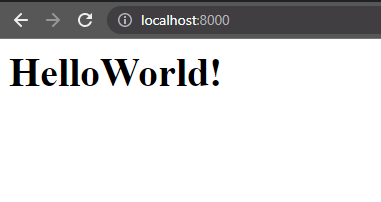

# Lab 4: Docker

Hello guys, Today we will learn everything that you need to know about to be the Docker master.

Firstly, we will be focusing on how to create a container without using Docker-compose which we will talk about it later.

## Objective
1. To learn how to create Docker Image.
2. How to use Docker container.

## What is Docker?
- Basically, it looks like VM but it is **NOT** VM. It is the **process**.
- For more informations please read here [Docker](https://docs.docker.com/get-started/overview/)
- Let say something like this. Assume you want to create your Django App with some databases with your team.
  - Situation 1
    - What do you need to do?
      - Install Python 3.8
      - **pip** many packages (For example Django V3)
      - Install X database version 2
      - coding 
    - In other sides (your friends in your team) want to help you coding.
      - Install Python 3.9
      - **pip** Django V4
      - Install X database version 3
      - **Cannot** run your code or missing some packages **BOOM!**
  - Situation 2
    - What do you need to do? (Assume you use Windows machine)
      - Install Python 3.8
      - **pip** many packages (For example Django V3)
      - Install X database version 2
      - coding 
    - Let say, you already done your jobs. You want to deploy to Ubuntu server.
      - How could you make sure that your **dev environment** is same as **production environment**?

- Docker can address those problems by create your own **environment**. Therefore, you can run your App in another machines with same **environment**.
- **Environment** == **Docker Container**

::: tip

- To make it short, Docker can solve "It works on my machine (but another machine cannot)."
  
:::

## Install Docker

### Windows User

::: warning Note for Windows User

For Windows User, we have a few ways how to get Docker.
- Docker Desktop with Hyper-V
- Docker Desktop with WSL2
- WSL2 and install Docker CE and Docker Client inside it

Currently, Docker Desktop with WSL2 is the best way.
:::

::: tip
For those who are using Windows for ML training with GPU. Docker Desktop WSL2 is support!
:::

- Download Docker Desktop [link](https://www.docker.com/products/docker-desktop)
- You need to install WSL2 (Version 2 Only!) for Docker Engine. (When you are installing **DockerDesktop.exe**, it would tell you how to do. Please follow it.)

### Mac OS User
- Download Docker Desktop [link](https://www.docker.com/products/docker-desktop)

### Ubuntu User
- remove old Docker in your machine and install new one with those scripts.
```bash
wget get.docker.com -O docker.sh
```
```bash
sudo sh docker.sh
```


## Docker Image
- To make it short, Docker Image looks like you are writing a Class (like programming) which has attribute, command and etc.
- There are many Docker image that you can use it. For example, nginx, MySQL, MongoDB and [more (click here for Docker Hub)](https://hub.docker.com/).

## Docker Container
- It looks like you are creating object from your class (Docker Image).

## Play HelloWorld

1. **docker run** is a command to create Docker container from Docker Image. If you do not have Docker Image, it would be downloaded (pull) automatically from Docker Hub.
```bash
docker run hello-world
```

output
```{1,2}
Unable to find image 'hello-world:latest' locally
latest: Pulling from library/hello-world
2db29710123e: Pull complete
Digest: sha256:cc15c5b292d8525effc0f89cb299f1804f3a725c8d05e158653a563f15e4f685
Status: Downloaded newer image for hello-world:latest

Hello from Docker!
This message shows that your installation appears to be working correctly.

To generate this message, Docker took the following steps:
 1. The Docker client contacted the Docker daemon.
 2. The Docker daemon pulled the "hello-world" image from the Docker Hub.
    (amd64)
 3. The Docker daemon created a new container from that image which runs the
    executable that produces the output you are currently reading.
 4. The Docker daemon streamed that output to the Docker client, which sent it
    to your terminal.

To try something more ambitious, you can run an Ubuntu container with:
 $ docker run -it ubuntu bash

Share images, automate workflows, and more with a free Docker ID:
 https://hub.docker.com/

For more examples and ideas, visit:
 https://docs.docker.com/get-started/
```

2. [List containers](https://docs.docker.com/engine/reference/commandline/ps/)

```bash
docker container ls -a
```
or
```bash
docker ps -a
```
output
```
CONTAINER ID   IMAGE                      COMMAND                  CREATED          STATUS                      PORTS                    NAMES
8788afbe7a64   hello-world                "/hello"                 12 minutes ago   Exited (0) 12 minutes ago                            vigilant_mendeleev
```

- Because your container (from hello-world Image) already done its job (return exited code 0). You needs **-a** option.
- As you can see all informations about this container.
  - Container ID
  - Image: Which is the Image that this container has been created.
  - Command: What is the **command** that this container needs to run when it's started.
  - Names: The name is actual name for this container.

3. Run again
```bash
docker run hello-world
```

```bash
docker ps -a
```

output
```
4c889b09335b   hello-world                "/hello"                 5 seconds ago    Exited (0) 3 seconds ago                            stupefied_curran
8788afbe7a64   hello-world                "/hello"                 22 minutes ago   Exited (0) 2 minutes ago                            vigilant_mendeleev
```

## Workshops: Create your own Docker Image with Dockerfile

### [Hello SAD Class](./hello-sad-class.md)
### [Nginx](./nginx.md)
### [FastAPI with Volume](./fast-api.md)

## Homework

1. Create your own **HelloWorld** web application container using Django.



2. Create a simple README.md to show your commands how to create and run your Image and Container.
3. Push your complete project to your GitHub.
4. Snapshot your WebApp and your Github link (link of your HW) and submit in PDF format to the Google Classroom.

[Solution](./hw-sol.md)

