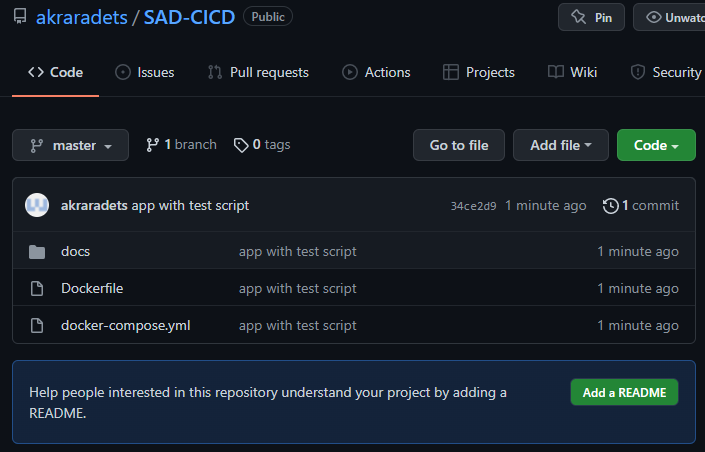
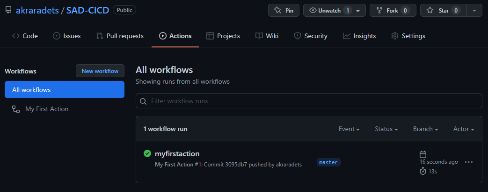
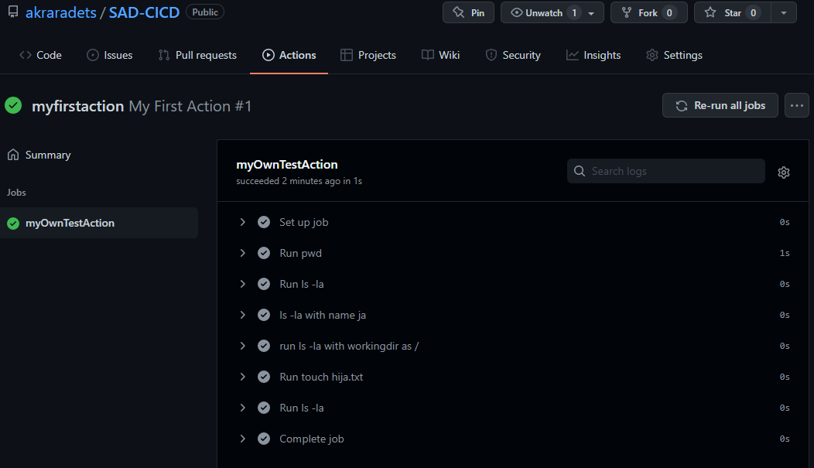

# Workshop 2. Continuous Testing and Integration

[[toc]]

Now that we have an app and a test script, we can set the GitHub Actions to run the test everytime we done something.

[Disable workflow](https://docs.github.com/en/actions/managing-workflow-runs/disabling-and-enabling-a-workflow)

## Task 2-1. Push the project to your GitHub Reposistory

Well, you know the way. Here is my result.



## Task 2-2. Create GitHub Actions

GitHub will looks for any `*.yml` files in your `/.github/workflows/`.

1. Create a folder `/.github/workflows/`

Current project tree
```txt
.
|--.github/
    |--workflows/
|--.git/
|--docs/
    |--tempProject/
        |--<main site code>
    |--manage.py
|--Dockerfile
|--docker-compose.yml
```

2. Create `1-myFirstScript.yml` in `workflows`.

```yml
name: My First Script
on: [push]
jobs:
  myOwnTestScript:
    runs-on: ubuntu-20.04
    steps:
      - run: pwd
      - run: ls -la
      - name: ls -la with name ja
        run: ls -la
      - name: run ls -la with workingdir as /
        run: ls -la
        working-directory: /
      - run: touch hija.txt
      - run: ls -la
```

3. `Commit` and `Push` 

4. Observe your reposistory





## Let's take a break and understand GitHub Actions

> [Understanding GitHub Actions](https://docs.github.com/en/actions/learn-github-actions/understanding-github-actions)
> 
> You can configure a GitHub Actions workflow to be triggered when an event occurs in your repository, such as a pull request being opened or an issue being created. Your workflow contains one or more jobs which can run in sequential order or in parallel. Each job will run inside its own virtual machine runner, or inside a container, and has one or more steps that either run a script that you define or run an action, which is a reusable extension that can simplify your workflow.
> 
> 

This is our workflow -> `1-myFirstScript.yml`
```yml
name: My First Script # This is the name of the workflow
on: [push] # This is the event. It is an array so there could be multiple events
jobs: # Here we define set of jobs
  myOwnTestScript: # Job#1 has a name of `myOwnTestScript`
    runs-on: ubuntu-20.04 # Job#1.runs-on define which OS environment to run
    steps: # Job#1.steps is a list of things to do
      - run: pwd # Job#1.steps[0] 
      - run: ls -la # Job#1.steps[1]
      - name: ls -la with name ja # Job#1.steps[2]
        run: ls -la
      - name: run ls -la with workingdir as / # Job#1.steps[3]
        run: ls -la
        working-directory: /
      - run: touch hija.txt # Job#1.steps[4]
      - run: ls -la # Job#1.steps[5]
```

In one sense, GitHub Actions creates a container based on `runs-on` argument and execute the list of steps in sequence. As you can see, for now, the script contain normal Terminal command.

3. Create `2-GitHubActions.yml` in `workflows`.

```yml
name: 2-GitHubAction.yml
on: [push]
jobs:
  integration:
    runs-on: ubuntu-20.04
    steps:
      - run: echo "Hi there everyone"
      # https://github.com/actions/checkout
      - uses: actions/checkout@v2 # Here we `uses` instead of `run`
      - run: ls -la
      - uses: actions/checkout@v2
        with:
          ref: master
      - run: ls -la
```

Aside from `run` that can execute Terminal command, `uses` runs `actions` .

> An action is a custom application for the GitHub Actions platform that performs a complex but frequently repeated task. Use an action to help reduce the amount of repetitive code that you write in your workflow files. An action can pull your git repository from GitHub, set up the correct toolchain for your build environment, or set up the authentication to your cloud provider.
> 
> You can write your own actions, or you can find actions to use in your workflows in the GitHub Marketplace.
> 
> For more information, see "[Creating actions](https://docs.github.com/en/actions/creating-actions)."

In short, `actions` is a `function`. Someone create this function and you can use it. We will learn more about creating your own `actions` later on. For now, we learn how to use it.

## Task 2-3. Continuous Integration (CI)

Before we jump right into the implementation, let's think about how would this tool makes sense.

We have a Django project and we want to test this project. Previously, we test the project using Unit Test library on our machine (Dev Stage). We done the development in a container environment. Thus, we control the environment. 

If we set the `workflow` environment to be the same as your container (install the same python version and same list of library + version), will this ensure that it will also works in your server (Production Stage)?

Now that I make you confuse, I will show you various way we could do this.

### Approach 1: Simple Integration

`3-simpleCI.yml`

```yml
name: 3-simpleCI
on: [push]
jobs:
  integration:
    runs-on: ubuntu-20.04
    steps:
      - name: Clone Reposistory
        uses: actions/checkout@v2
      - name: Set up Python 3.10.2
        uses: actions/setup-python@v2
        with:
          python-version: 3.10.2
      - name: Install pip
        run: |
          python3 -m pip install --upgrade pip
          pip3 install django==4.0.2
          pip3 install gunicorn==20.1.0
      - name: Automate test
        run: |
          python3 manage.py test
        working-directory: ./docs
```

### Approach 2: OK, I will just use Docker

`4-simpleCI-with-docker.yml`

```yml
name: 4-simpleCI-with-docker
on: [push]
jobs:
  integration:
    runs-on: ubuntu-20.04
    steps:
      - name: Clone Reposistory
        uses: actions/checkout@v2
      - name: Create Docker
        run: docker-compose up --build -d
      - name: Automate test
        run: docker-compose exec django python3 manage.py test
```

Do you see any differences between the two methods? Surely, `Approach 2` is nearly the same as our Dev Stage with only difference is the Host machine is Ubuntu (if you are running Ubuntu 20.04 then it is completely the same, kind of). Is that the only difference? 

### Approach 1++: Integration with Matrix

`5-matrixCI.yml`

```yml
name: 5-matrixCI
on: [push]
jobs:
  integration:
    runs-on: ubuntu-20.04
    strategy:
      # if true, when job die, other will die. "operation cancelled."
      fail-fast: false
      matrix:
        python-version: [3.6, 3.7, 3.8, 3.9, 3.10.2]
    steps:
      - name: Clone Reposistory
        uses: actions/checkout@v2
      - name: Set up Python ${{ matrix.python-version }}
        uses: actions/setup-python@v2
        with:
          python-version: ${{ matrix.python-version }}
      - name: Install pip
        run: |
          python3 -m pip install --upgrade pip
          pip3 install django==4.0.2
          pip3 install gunicorn==20.1.0
      - name: Automate test
        run: |
          python3 manage.py test
        working-directory: ./docs
```

This way, we could ensure that our code works on multiple version of python. Fancy stuff. You can see that if we want to achieve `Approach 2++` we would need to prepare multiple Dockerfile for each python version we want to test.

OK. So. Which one do we use? The first or the second one?

Well, that is depens on you. The answer could be any or neither. What do you need to achieve from this automation? If you only want to run test script as frequent as possible then both approachs would get the job done. But if you want to ensure that your code will work once deploy to the production, both approachs might not do that for you.

Let me reiterate the sentence.

> **me from 10 minutes ago**
> 
> Before we jump right into the implementation, let's think about how would this tool makes sense.


<div class="page-nav"><p class="inner">
    <span class="prev"> 
        ←
        <a href="./ws1.html" class="">Workshop 1 - Django Unit Test</a>
    </span> 
    <span class="next">
        <a href="./ws3.html" class="">Workshop 3 - Automate Deploy</a>
        →
    </span></p>
</div>